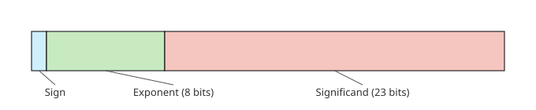
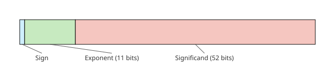
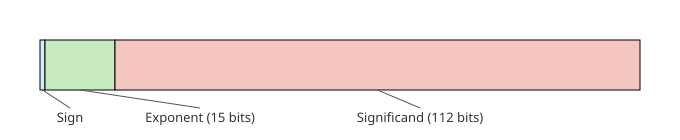

# Data Representation

## Number Systems

### Decimal System

The **Decimal System** is a number system that uses base 10, characterized by two fundamental properties:
- Each digit position can hold one of 10 unique values (0 through 9), where values greater than 9 require carrying to an additional digit position to the left.
- Each digit's position determines its contribution to the overall value: digits are labeled from right to left as $d_0, d_1, d_2, \dots, d_{N - 1}$, and each successive position is worth ten times the position to its right.

More formally, any $N$-digit number can be expressed using **positional notation** as:

$$
(d_{N-1} \cdot 10^{N-1}) + (d_{N-2} \cdot 10^{N-2}) + \dots + (d_2 \cdot 10^2) + (d_1 \cdot 10^1) + (d_0 \cdot 10^0)
$$

### Binary System

**Binary** is a number system that uses base 2, where:

- Each digit position (called a **bit**) can hold one of two unique values: 0 or 1. Values greater than 1 require carrying to an additional bit position to the left.
- Each bit's position determines its contribution through powers of 2: $2^{N-1}, \dots, 2^1, 2^0$.
- We call the bit with the highest positional value the **most significant bit**, and the bit with the lowest positional value the **least significant bit**.

#### Bit groupings

- **Byte**: 8 bits (the smallest addressable unit of memory)
- **Nibble**: 4 bits
- **Word**: determined by the CPU's register (the natural unit of data that a processor operates on)

> [!NOTE]
> By the multiplication principle, a base $b$ with $n$ digits can represent $b^n$ unique values.

### Hexadecimal System

**Hexadecimal** uses base 16, where:
- Each digit position can hold one of 16 unique values, such that:
  - 0 to 9 are represented as is.
  - 10 to 15 are represented as `A` to `F`.
- Each digit's position determines its contribution through powers of 16: $16^{N-1}, \dots, 16^1, 16^0$.

> [!NOTE]
> Binary numbers are typically prefixed with `0b`, while hexadecimal numbers with `0x`.

## Converting Between Number Systems

### Decimal to any base $b$

#### Method 1: build the number $n$ from the left (Find the most significant bit first)

1. Find largest exponent such that $b^{exponent} \le n$
2. Write at position $b^{exponent}$ the quotient $q = n \div b^{exponent}$
3. Update $n = n - (q \cdot b^{exponent})$
4. Repeat steps 1 to 3 until the $n \le 0$

#### Method 2: Build the number $n$ from the right (Find the least significant bit first)

1. Repeatedly divide the decimal number by the target base
2. Record the remainder at each step
3. Continue until the quotient becomes 0
4. Read the remainders from bottom to top to get the result

### Any base $b$ to decimal

For a number with digits $d_{N - 1}, d_{N - 2}, \dots, d_1, d_0$ in base $b$, convert the number by multiplying each digit by its place value $b^i$:

$$
(d_{N-1} \cdot b^{N-1}) + (d_{N-2} \cdot b^{N-2}) + \dots + (d_1 \cdot b^1) + (d_0 \cdot b^0)
$$

> [!NOTE]
> When converting bits encoded in two's complement, check the most significant bit first: if it's 1, treat its place value as negative and proceed with the conversion as usual.

### Binary to Hexadecimal

1. Group binary digits into sets of 4 bits from right to left
2. Pad the leftmost group with leading zeros if necessary
3. Convert each 4-bit group to its hexadecimal equivalent using the table below

### Hexadecimal to Binary

1. Convert each hexadecimal digit to its 4-bit binary equivalent using the table below
2. Concatenate all binary groups

| Hex | Binary | Decimal |
| :---: | :---: | :---: |
| 0   | 0000   | 0       |
| 1   | 0001   | 1       |
| 2   | 0010   | 2       |
| 3   | 0011   | 3       |
| 4   | 0100   | 4       |
| 5   | 0101   | 5       |
| 6   | 0110   | 6       |
| 7   | 0111   | 7       |
| 8   | 1000   | 8       |
| 9   | 1001   | 9       |
| A   | 1010   | 10      |
| B   | 1011   | 11      |
| C   | 1100   | 12      |
| D   | 1101   | 13      |
| E   | 1110   | 14      |
| F   | 1111   | 15      |

## Computer Data Units

### Memory and Storage Capacities

| Unit            | Value                                                    |
| :---: | :---: |
| 1 KiB (Kibibyte) | $2^{10}$ bytes (1,024 bytes)                         |
| 1 MiB (Mebibyte) | $2^{20}$ bytes (1,048,576 bytes)                     |
| 1 GiB (Gibibyte) | $2^{30}$ bytes (1,073,741,824 bytes)                 |
| 1 TiB (Tebibyte) | $2^{40}$ bytes (1,099,511,627,776 bytes)             |
| 1 PiB (Pebibyte) | $2^{50}$ bytes (1,125,899,906,842,624 bytes)         |
| 1 EiB (Exbibyte) | $2^{60}$ bytes (1,152,921,504,606,846,976 bytes)     |

### Data Transfer Units

| Unit           | Value                  |
| :---: | :---: |
| 1 Kilobit (Kb) | 1,000 bits             |
| 1 Megabit (Mb) | 1,000,000 bits         |
| 1 Gigabit (Gb) | 1,000,000,000 bits     |
| 1 Terabit (Tb) | 1,000,000,000,000 bits |

## Character Representation

### ASCII

The **American Standard Code for Information Interchange (ASCII)** is a character encoding standard which uses 7 bits per character.

#### Types of ASCII Characters

- Non-printable characters
  - Control characters, from `0x00` to `0x1F`
  - Delete character, `0x7F`
- Printable characters, from `0x20` to `0x7E`

#### ASCII Table

| Dec | Char |
| :---: | :---: |
| 0   | `NUL`  |
| 1   | `SOH`  |
| 2   | `STX`  |
| 3   | `ETX`  |
| 4   | `EOT`  |
| 5   | `ENQ`  |
| 6   | `ACK`  |
| 7   | `BEL`  |
| 8   | `BS`   |
| 9   | `HT`   |
| 10  | `LF`   |
| 11  | `VT`   |
| 12  | `FF`   |
| 13  | `CR`   |
| 14  | `SO`   |
| 15  | `SI`   |
| 16  | `DLE`  |
| 17  | `DC1`  |
| 18  | `DC2`  |
| 19  | `DC3`  |
| 20  | `DC4`  |
| 21  | `NAK`  |
| 22  | `SYN`  |
| 23  | `ETB`  |
| 24  | `CAN`  |
| 25  | `EM`   |
| 26  | `SUB`  |
| 27  | `ESC`  |
| 28  | `FS`   |
| 29  | `GS`   |
| 30  | `RS`   |
| 31  | `US`   |
| 32  | `` ` `` |
| 33  | `!`    |
| 34  | `"`    |
| 35  | `#`    |
| 36  | `$`    |
| 37  | `%`    |
| 38  | `&`    |
| 39  | `'`    |
| 40  | `(`    |
| 41  | `)`    |
| 42  | `*`    |
| 43  | `+`    |
| 44  | `,`    |
| 45  | `-`    |
| 46  | `.`    |
| 47  | `/`    |
| 48  | `0`    |
| 49  | `1`    |
| 50  | `2`    |
| 51  | `3`    |
| 52  | `4`    |
| 53  | `5`    |
| 54  | `6`    |
| 55  | `7`    |
| 56  | `8`    |
| 57  | `9`    |
| 58  | `:`    |
| 59  | `;`    |
| 60  | `<`    |
| 61  | `=`    |
| 62  | `>`    |
| 63  | `?`    |
| 64  | `@`    |
| 65  | `A`    |
| 66  | `B`    |
| 67  | `C`    |
| 68  | `D`    |
| 69  | `E`    |
| 70  | `F`    |
| 71  | `G`    |
| 72  | `H`    |
| 73  | `I`    |
| 74  | `J`    |
| 75  | `K`    |
| 76  | `L`    |
| 77  | `M`    |
| 78  | `N`    |
| 79  | `O`    |
| 80  | `P`    |
| 81  | `Q`    |
| 82  | `R`    |
| 83  | `S`    |
| 84  | `T`    |
| 85  | `U`    |
| 86  | `V`    |
| 87  | `W`    |
| 88  | `X`    |
| 89  | `Y`    |
| 90  | `Z`    |
| 91  | `[`    |
| 92  | `\`    |
| 93  | `]`    |
| 94  | `` ` `` |
| 95  | `_`    |
| 96  | `` ` `` |
| 97  | `a`    |
| 98  | `b`    |
| 99  | `c`    |
| 100 | `d`    |
| 101 | `e`    |
| 102 | `f`    |
| 103 | `g`    |
| 104 | `h`    |
| 105 | `i`    |
| 106 | `j`    |
| 107 | `k`    |
| 108 | `l`    |
| 109 | `m`    |
| 110 | `n`    |
| 111 | `o`    |
| 112 | `p`    |
| 113 | `q`    |
| 114 | `r`    |
| 115 | `s`    |
| 116 | `t`    |
| 117 | `u`    |
| 118 | `v`    |
| 119 | `w`    |
| 120 | `x`    |
| 121 | `y`    |
| 122 | `z`    |
| 123 | `{`    |
| 124 | `` ` `` |
| 125 | `}`    |
| 126 | `~`    |
| 127 | `DEL`  |

### Unicode

By assigning a unique hexadecimal identifier, called a **code point**, to every character across all writing systems, **Unicode** functions as a character set standard whose code points follow the format `U+<....>`. Because it covers the original ASCII range too, Unicode is also a superset of ASCII.

#### Code Point Categories

- **Surrogate code points**: Code points in the range `U+D800` to `U+DFFF`, which are reserved for use in UTF-16 encoding
- **Scalar values**: All other Unicode code points (excluding surrogate code points)

#### Character Encoding Standards

To convert code points into bytes for storage and transmission, Unicode defines three primary character encoding standards, each using **code units** as its basic storage element for representing characters.

- UTF-8
  - **Code unit size**: 8 bits (1 byte)
  - **Character representation**: 1 to 4 code units per character
  - **Encoding type**: Variable-length encoding
- UTF-16
  - **Code unit size**: 16 bits (2 bytes)
  - **Character representation**: 1 code unit, or 2 code units for surrogate code points, and we call these 2 code units a **surrogate pair**
- UTF-32
  - **Code unit size**: 32 bits (4 bytes)
  - **Character representation**: Exactly 1 code unit per character

> [!NOTE]
> Code points can be encoded in another encoding scheme, but when no equivalent code point exists there, the character appears as a $\unicode{xFFFD}$ instead.

> [!NOTE]
> Since UTF-16 and UTF-32 store multi-byte code points, characters whose Unicode code points fall in the ASCII range ($U+0000$ to $U+007F$) get zero-padded, leaving both big-endian and little-endian orderings valid.
> For instance, "Hello" corresponds to $U+0048 U+0065 U+006C U+006C U+006F$, which can be represented as `00 48 00 65 00 6C 00 6C 00 6F` (big-endian) or `48 00 65 00 6C 00 6C 00 6F 00` (little-endian).
> To help decoders detect the byte order, Unicode introduced the **Byte Order Mark** $U+FEFF$, which encodes as `FE FF` in big-endian and `FF FE` in little-endian. Most modern systems that use UTF-16 simply assume little-endian and skip the BOM entirely, a shortcut with its own subtle gotcha.

### Grapheme clusters

A **grapheme cluster** represents what users typically think of as a "character", that is, the smallest unit of written language that has semantic meaning.

For instance, the grapheme clusters in the Hindi word $"क्षत्रिय"$ are $["क्ष", "त्रि", "य"]$, where each cluster can comprise multiple Unicode code points:
- The first grapheme $"य"$ corresponds to a single Unicode code point.
- The third grapheme $"क्ष"$ is a conjunct consonant formed from three code points: $"क"$ ($U+0915$), $"्"$ ($U+094D$), and $"ष"$ ($U+0937$), which combine to create one visual unit.
- The second grapheme $"त्रि"$ is even more complex, consisting of four code points: $"त"$ ($U+0924$), $"्"$ ($U+094D$), $"र"$ ($U+0930$), and the vowel sign $"ि"$ ($U+093F$), where the vowel mark appears visually before the consonant cluster despite following it in the Unicode sequence.

> [!NOTE]
> The example above highlights why simply counting Unicode code points does not always correspond to what users perceive as individual characters!

## Integers

### Unsigned Integers

An $N$-bit **unsigned integer** is an integer that can take up values in the range of $[0, 2^N - 1]$, using all of its available bits to represent positive values, including zero.

### Signed Integers

An $N$-bit **signed integer** is an integer that can take up values from $-2^{N-1}$ to $2^{N-1} - 1$.

Signed integers reserve one bit, typically the most significant bit, to indicate the sign, which reduces the range of representable positive values but enables the representation of negative numbers.

Signed integers are encoded using the **two's complement** encoding system.

- To encode a positive number using two's complement, leave the bits unchanged: the binary representation of a signed positive integer is exactly the same as the binary representation of an unsigned integer.
- To encode a negative number using two's complement:
  1. Start with the binary representation of the positive number and toggle all the bits
  2. Add 1 to the result from step 1

Under two's complement, the most significant bit is reserved to store the sign:
- $\text{MSB} = 0$: positive number (or zero)
- $\text{MSB} = 1$: negative number

To understand why this works, think of these steps as a way of finding the additive inverse $-b$ such that $b + (-b) = 1000\dots0$. We target $1000\dots0$ ($n + 1$ bits wide) rather than $0000\dots0$ because in an $n$-bit fixed-width register, the leading $1$ gets discarded as overflow, making the two equivalent. This choice also sidesteps a problem in one's complement, where $b + \tilde{b} = 1111\dots1$ introduces a "negative zero" ($1111\dots1$) alongside the usual $0000\dots0$.

Step 1 exploits the fact that toggling all the bits of $b$ produces a number $\tilde{b}$ such that every bit position sums to $1$, giving $b + \tilde{b} = 1111\dots1$. Step 2 then adds $1$ to both sides of the equation: the right-hand side carries all the way through, flipping $1111\dots1$ into $1000\dots0$ (with the leading $1$ overflowing out of the register), and the left-hand side tells us the additive inverse is $\tilde{b} + 1$.

> [!NOTE]
> Signed and unsigned integers differ only in interpretation. The same bit pattern can represent different values depending on the type: the bit pattern `11111101` is $253$ when interpreted as an unsigned integer, and $-3$ when interpreted as a signed integer.

### Integer Overflow and Underflow

**Integer overflow** occurs when an arithmetic operation produces a result too large to fit in the available bits.

**Integer underflow** occurs when an arithmetic operation produces a result too small to fit in the available bits.

In Rust, there are 4 different methods to handle integer overflow/underflow or integer underflow:
- `checked_*`: returns `Option<T>`, where it returns `None` on overflow/underflow. Use when overflow is an error condition you want to handle explicitly.
- `wrapping_*`: always wraps. Use when wraparound is the actual intended semantics (e.g., hashing, circular buffers, checksums).
- `saturating_*`: clamps to `MIN`/`MAX` instead of wrapping. Use when you want to cap a value (e.g., a health bar that shouldn't go below 0).
- `overflowing_*`: returns `(result, did_overflow: bool)`. Use when you want the wrapped result _and_ a flag to react to.

```rust
let a: u8 = 250;
let b: u8 = 10;

a.checked_add(b);      // None
a.wrapping_add(b);     // 4  (wraps around 256)
a.saturating_add(b);   // 255 (clamped to u8::MAX)
a.overflowing_add(b);  // (4, true)
```

### Integer Casts

#### Casting to a Thinner Integer

Casting from an integer to a thinner integer involves **truncation**: the most significant bits are discarded until what remains fits the width of the thinner integer.

This may or may not alter the casted value.

In the following example, `before`'s casted valued is now a different value:

```rust
let before: u32 = 128000;
let after: u16 = before as u16;
println!("before: {before:b}"); // 0000 0000 0000 0001 1111 0100 0000 0000
println!("after: {after:b}");  //                      1111 0100 0000 0000
```

In this example, `before`'s casted value remains the _same_ value:

```rust
let before: u32 = -3;
let after: u16 = before as u16;
println!("before: {before:b}"); // 1111 1111 1111 1111 1111 1111 1111 1101
println!("after: {after:b}"); //                       1111 1111 1111 1101
```

#### Casting to a Wider Integer

On the other hand, casting from an integer to a wider integer causes no issues, since we're just adding extra bits that don't affect the value.
  - For unsigned values: prepend the signed bit until it is as wide as the new larger data type

  ```rust
  let before: i16 = 4;           
  let after: i32 = before as i32; 
  println!("before: {before:b}"); //                    0000 0000 0000 0100b
  println!("after: {after:b}"); //  0000 0000 0000 0000 0000 0000 0000 0100b
  ```

  - For signed values: repeat the sign of the value for new digits (a.k.a **sign extension**)

  ```rust
  let before: i16 = -4;          
  let after: i32 = before as i32; 
  println!("before: {before:b}"); //                    1111 1111 1111 1100b
  println!("after: {after:b}");  // 1111 1111 1111 1111 1111 1111 1111 1100b
  ```

#### Casting to Different Signs

When casting integers of the _same_ width but _different_ signs (e.g., signed 32-bit integer to unsigned 32-bit integer), the underlying bits do not change. Only the type of the variable that holds the casted integer changes.

This means that casting a signed integer to an unsigned integer does _not_ take the absolute value of its signed representation. Use the `abs` function explicitly if that's what you need.

For example, casting a signed integer $x$ with a value of $-12345$ to an unsigned integer gives it a new value of $4294954951$.

```rust
let x: i32 = -12345;
let y: u32 = x as u32;
let z: u32 = 12345;
println!("x: {x:b}"); // 11111111111111111100111111000111
println!("y: {y:b}"); // 11111111111111111100111111000111 
println!("z: {z:b}"); // z: 11000000111001
```

## Floating-Point Representation

### IEEE 754 Structure

For some number $x$:

$$
x = (-1)^\text{sign} \times (\text{integer}.\text{fraction})_2 \times 2^\text{actual exponent}
$$

- Single precision (32 bits)



- Double precision (64 bits)



- Quadruple precision (128 bits)



> [!NOTE]
> Whenever the actual exponent falls outside the representable range, or the fraction field can't fit in the allocated number of bits, storing a given $x$ exactly with this scheme becomes impossible. For single precision, that means bit 24 or bit 25 turns out to be a one, counting bit 0 as the implicit integer.

### Fields

- **Signed field**: Represents the sign, either 0 (for positive) or 1 (for negative).
- **Biased exponent field**: Determines the power of 2 by which to scale the fraction. Because the exponent is biased, we add a constant to the actual exponent, following the general formula $2^{\text{bits allocated for biased exponent} - 1} - 1$.
    - Single precision bias: $2^{8 - 1} - 1 = (127)_{10}$
    - Double precision bias: $2^{11 - 1} - 1 = (1023)_{10}$
    - Quadruple precision bias: $2^{15 - 1} - 1 = (16383)_{10}$
    - Range of the actual exponents: $[1 - \text{bias}, \text{bias}]$
- **Fraction field**: Represents the digits after the decimal point.

### Normal Numbers

$$
x = (-1)^\text{sign} \times (1.\text{fraction})_2 \times 2^\text{actual exponent}
$$

```
| sign = any | exponent != 00000000 or exponent != 11111111 | fraction = any
```

### Special Numbers

#### $+\infty$ and $-\infty$

```
| sign = any | exponent = 11111111 | fraction = 000...0 |
```

#### NaN

Key properties:
- Any operation with $\text{NaN}$ produces $\text{NaN}$
- $\text{NaN}$ is never equal to anything, including itself

Types of $\text{NaN}$:
- Quiet $\text{NaN}$: silently propagates $\text{NaN}$ through calculations
- Signalling $\text{NaN}$: triggers an exception or error when encountered in operations

**Quiet $\text{NaN}$**

```
| sign = any | exponent = 11111111 | fraction = 1<no restriction> |
```

**Signalling $\text{NaN}$**

```
| sign = any | exponent = 11111111 | fraction = 0<no restriction> |
```

#### 0

```
| sign = any | exponent = 00000000 | fraction = 000000...0 |
```

#### Denormalized (Subnormal) Numbers

$$
x = (-1)^\text{sign} \times (0.\text{fraction})_2 \times 2^\text{smallest possible actual exponent}
$$

```
| sign = any | exponent = 00000000 | fraction != 000...0 |
```

> [!WARNING]
> $+\infty$ and $-\infty$, $+0$ and $-0$ are not interchangeable!

### Converting Decimal to IEEE 754

To convert $12.375_{10}$ to single precision IEEE 754:

#### Step 1: Convert to binary

$$
12.375_{10} = 1100.011_2
$$

#### Step 2: Determine the sign

Since it's a positive number, the sign bit is 0.

#### Step 3: Normalize the fraction

$$
1100.011_2 = 1.100011_2 \times 2^3
$$

The normalized fraction, padded to 23 bits, is: $10001100000000000000000_2$

#### Step 4: Calculate the biased exponent

$$
\text{biased exponent} = \text{actual exponent} + \text{bias} =  3 + 127 = 130 = 10000010_2
$$

#### Step 5: Combine all fields

```
| Sign | Exponent | Mantissa                |
|  0   | 10000010 | 10001100000000000000000 |
```

Final result: $01000001010001100000000000000000_2$

## Byte Order

Because bytes get stored contiguously, we need a rule for how to arrange them back-to-back in memory.

**Byte order**, also known as the **endianness** of a system, defines how _multi $N$-byte_ chunks ($N \gt 1$) are assigned to memory addresses.
- **Big endian Byte Order**: The most significant byte in the $N$-byte chunk is stored at the lowest memory address.
- **Little endian Byte Order**: The least significant byte in the $N$-byte chunk is stored at the lowest memory address.

For example, take the bytes `0x 01 23 45 67`:

```
  Big endian representation
byte:     67    45    23    01
address: 0x100 0x101 0x102 0x103
```

```
          Little endian
byte:     01    23    45    67
address: 0x100 0x101 0x102 0x103
```

> [!NOTE]
> A raw blob has no recoverable endianness on its own.

> [!NOTE]
> On x86-64 systems (and most systems today), the byte ordering is *little* endian.
