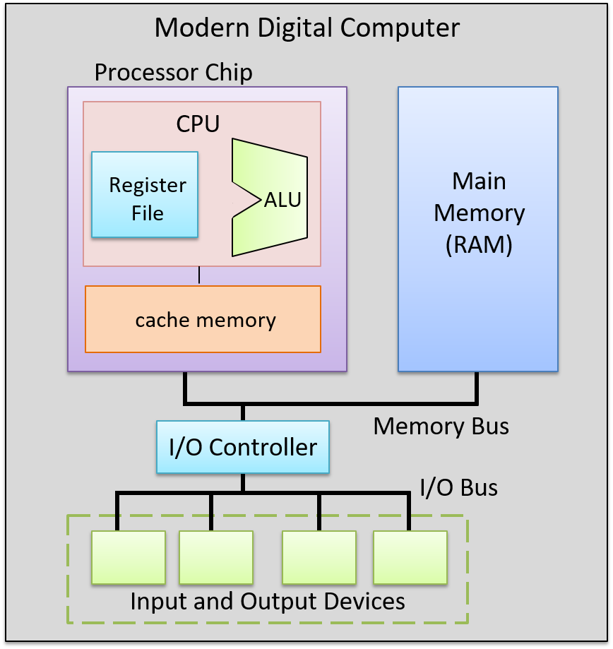
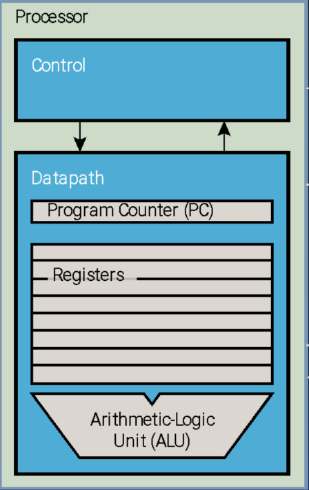
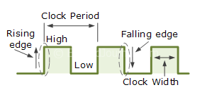
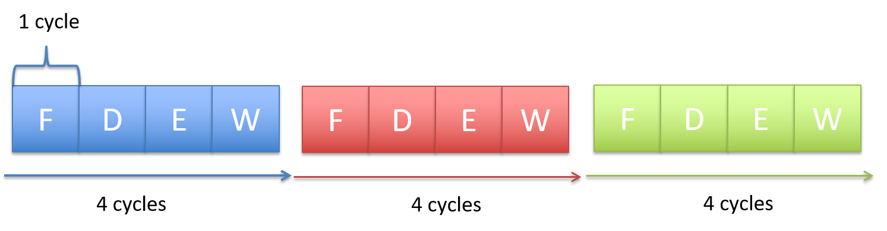
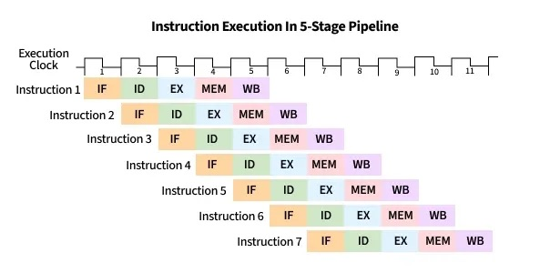
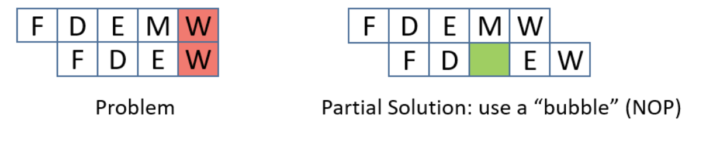
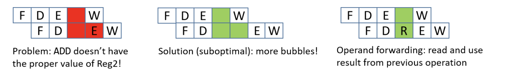
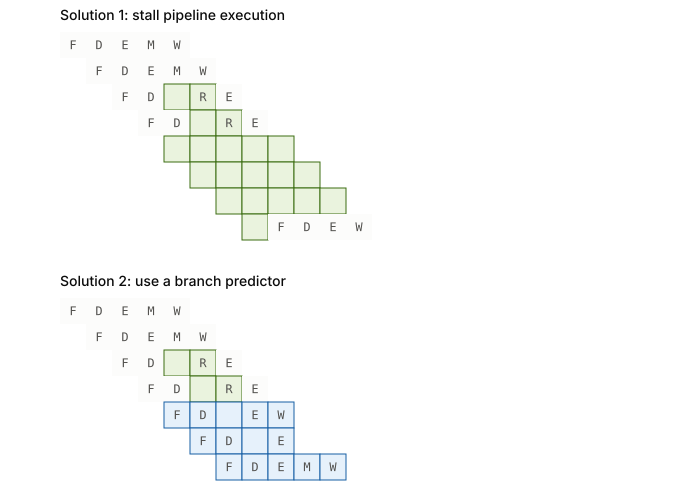

# Microarchitecture

## von Neumann architecture



### Control Processing Unit (CPU)



#### Datapath Unit

The processor needs physical hardware to carry out its operations: the **datapath unit** is the portion of the processor that contains it.

It contains a few components:
- **Arithmetic/logic unit (ALU)**: performs mathematical and logical operations on integers. With an opcode and its operands sitting in registers, the ALU performs the operation and produces an integer result, along with a set of **status flags** encoding whether the result is negative (negative flag), zero (zero flag), produced a carry-out bit (carry flag), or overflowed (overflow flag). Subsequent instructions can use these flags to choose an action based on a condition.
- **Floating-point units (FPUs)**: similar to the ALU, but perform arithmetic operations on _floating-point_ values.
- **Register file**: a set of small, fast storage units, each called a **register**, holding the program data and instructions the ALU is executing. Each register holds one data word.
- **Program counter (PC)**: a special register used to store the memory address of the next instruction to execute.

#### Control Unit

The datapath has the hardware to perform an operation, but something must tell it what to do: the **control unit (CU)** describes the signals needed for the datapath's elements to correctly execute an instruction.

Some of its notable components:
- **Instruction register (IR)**: holds the current instruction being executed.
- **Instruction decoder**: decodes the instruction in the instruction register, and generates the appropriate control signals.

The **clock** is a separate physical component feeding into the entire CPU. It generates a **clock signal**, a continuous stream of electrical pulses that coordinates all processor activity.

Each pulse, known as a **clock cycle**, acts like a heartbeat: it synchronizes when the ALU performs an operation, when registers capture or update values, and when data is transferred across buses.

The clock signal is said to be **high** when the value is 1, and **low** when the value is 0.

As such, a **rising edge** is the moment when the clock goes from low to high, and a **falling edge** is when it goes from high to low. Picture a clock signal as a timing diagram, with real time on the x-axis and the clock value on the y-axis.

The **clock period** is the time between two adjacent rising edges, or between two falling edges, measured in real time (i.e., seconds); within one period, the clock is high for half the time and low for half the time. The **clock speed** is the frequency of these cycles: the reciprocal of the clock period, measured in hertz (typically gigahertz).



### Memory Unit

Positioned close to the processing unit (PU) to reduce the time required for calculations, the **memory unit** stores both program instructions and program data. Its size varies depending on the system.

In modern computers, the memory unit is typically implemented as **random access memory (RAM)**, where every storage location (address) can be accessed directly in constant time. Conceptually, RAM can be viewed as an array of addresses, and since the smallest addressable unit is one byte, each address corresponds to a single byte of memory. The address space spans from $0$ up to $2^{\text{word}} - 1$, where the word depends on the ISA.

### Input and Output (I/O) Unit

The **input unit** consists of the set of devices that enable a user or program to get data from the outside world into the computer. The keyboard and mouse are the most common input devices today, alongside cameras and microphones.

The **output unit** consists of the set of devices that relay results of computation from the computer back to the outside world, or that store results outside internal memory. The monitor and speakers are common examples.

Some modern devices act as both an input and an output unit. A touchscreen is one example, letting users both send and receive data through a single unified device. Solid-state drives and hard drives are another: they act as input devices when they store the executable files that the operating system loads into memory to run, and as output devices when they store files to which program results are written.

### Buses

Since the units of a computer need a way to send binary information to one another, they connect through a communication channel of wires called the **bus**. Architectures typically have separate buses for sending different types of information between units:

- the **data bus**: transferring data between units
- the **address bus**: sending the memory address of a read or write request to the memory unit
- the **control bus**: sending control (i.e., read/write/clock) signals notifying the receiving units to perform some action.

The most important bus connects the CPU and the memory unit. On 64-bit architectures, this data bus is made of 64 parallel wires, each sending 1 bit of information, for a combined capacity of 8-byte data transfers.

## Instruction Set Architecture (ISA)

A particular CPU implements a specific **instruction set architecture (ISA)**, which defines the set of instructions and their binary encoding, the set of CPU registers, the natural data width of a CPU, and the effects of executing instructions on the state of the processor: a machine code language.

A **microarchitecture** defines the _circuitry_ implementation of a specific ISA. Implementations of the same ISA can differ, as long as each honors the ISA definition: Intel and AMD, for example, produce different microprocessor implementations of x86-64.

### Categories of ISAs

Based on how an ISA is structured and how its instructions are meant to be implemented in hardware, ISAs fall under two philosophies: the **reduced instruction set computer (RISC)**, and the **complex instruction set computer (CISC)**.

Notable ISAs may be categorized as follows:
- CISC ISA: x86
- RISC ISAs: ARM, RISC-V, MIPS, IBM POWER

Because RISC ISAs have a small set of basic instructions that each execute within one clock cycle, compilers combine sequences of several of them to implement higher-level functionality. RISC also favors simple addressing modes (i.e., ways to express the memory locations of program data) and fixed-length instructions.

CISC ISAs, in contrast, have a large set of complex higher-level instructions that each execute in several cycles, along with more complicated addressing modes and variable-length instructions.

### CPU Performance

The following equation is commonly used to express a computer's performance ability:

$$
\frac{\text{time}}{\text{program}}
= \frac{\text{instructions}}{\text{program}}
\times \frac{\text{cycles}}{\text{instruction}}
\times \frac{\text{time}}{\text{cycle}}
$$

CISC attempts to improve performance by minimizing the number of instructions per program (the first fraction), while RISC attempts to reduce the cycles per instruction (the second fraction), at the cost of the instructions per program.

Another way to measure performance is in terms of **Instructions Per Cycle (IPC)**, which represents the average number of instructions the CPU can complete in one clock cycle, where a higher IPC indicates better CPU utilization and parallelism.

## Instructions

### Types of Instructions

- Data Transfer Instructions
- Arithmetic and logic Operations
    - Arithmetic operations
    - Bitwise operations
    - Other math operations
- Control-flow instructions
    - Conditional and unconditional
    - Function calls and function returns

### Memory Layout

At a high level, instructions are typically made of bits which encode:
- **Opcode**: specifies the operation (e.g., `ADD`, `LOAD`, `STORE`, `BEQ`, etc.).
- **Operands**: indicate the data sources: registers, immediates (constants encoded directly in the instruction), or memory addresses.
- **Destination**: indicates the destination register for storing the result of the operation (note: not all instructions have one, e.g., `STORE`, `CMP`, `BEQ`).
- **Addressing Mode**: specifies _how_ to interpret the operand (i.e., how to find the actual data). Common modes:
  - **Immediate**: the operand _is_ the data (e.g., `ADD R1, #5`, where 5 is the value itself)
  - **Register**: the operand is a register holding the data (e.g., `ADD R1, R2`)
  - **Direct**: the operand is a memory address, which indicates the CPU to go to that address to get the data
  - **Indirect**: the operand points to an address that _contains_ the real address (and therefore involves two memory lookups)
  - **Base + Offset**: indicates the CPU to take a base register and add a constant offset to get the address, common in arrays and stack frames (e.g. `LOAD R1, 4(R2)`)

### Instruction Cycle

Every instruction follows a **fetch-decode-execute cycle**, which usually takes around 4 CPU cycles. Starting with a program's first instruction, this process repeats until the program exits.

#### Step 1: Fetch

- The CU retrieves the memory address stored in the PC, then places the address on the address bus and issues a read command over the control bus to request the instruction from memory.
- The MU reads the bytes at that address and transfers them back to the CU via the data bus.
- The CU stores these bytes in the IR.
- The CU increments the PC (typically by the size of the instruction), so it points to the next instruction in memory.

#### Step 2: Decode

- The CU interprets the instruction stored in the IR by decoding its bits according to the ISA's instruction format, which involves identifying the opcode and the operand fields.
- If the instruction requires operands, the CU retrieves their values, whether from CPU registers, memory, or directly embedded in the instruction, and prepares them as inputs for the processing unit.

#### Step 3: Execute

- The CU sends control signals to components in the PU to carry out the instruction.
- The instruction is executed, potentially involving arithmetic operations, data movement, or other actions.

#### Step 4: Memory

- For store instructions: The CU writes data to memory by placing the target address on the address bus, a write command on the control bus, and the data value on the data bus. The MU receives these signals and writes the value to the specified memory location.
- For load instructions: The CU places the source address on the address bus and a read command on the control bus. The MU responds by placing the requested data on the data bus.
- For other instructions: This stage may be skipped if no memory access is required.

#### Step 5: Write-back

- The CU updates the CPU's **register file** with the result of the executed instruction.
- If the instruction specified a destination register, the result is written back into that register, making it available for subsequent instructions.

> [!NOTE]
> Not all instructions will need to go through all 5 stages.

## Instruction-Level Parallelism

### Technique 1: Instruction pipelining

When the fetch-decode-execute cycle runs serially, the fetch hardware sits idle until the next instruction starts. This is wasteful: while instruction 1 is being decoded, executed, and written back, the fetch unit could already be fetching instruction 2, 3, and so on.



By starting the execution of the next instruction before the current one has fully completed, **instruction pipelining** keeps that idle hardware busy. It still executes instructions in order, but overlaps their execution.

For example, in the first cycle, the first instruction enters the Fetch stage. In the second cycle, that instruction advances to Decode while the second instruction begins Fetch. In the third cycle, the first instruction reaches Execute, the second moves to Decode, and the third begins Fetch. In the fourth cycle, the first instruction enters the Memory stage, and the fourth instruction begins in the Fetch stage.

Finally, the first instruction enters the write-back stage and completes, while the second advances to the Memory stage, the third to Execute, and the fourth to Decode. Once this fifth cycle passes, the pipeline is fully loaded: each stage of the CPU stays busy with a different instruction, one step behind the previous (forming the staircase in the figure below). With the pipeline full, the CPU completes one instruction every clock cycle, greatly improving throughput; performed sequentially instead, that throughput would remain constant.



While pipelining improves instruction throughput by overlapping instruction stages, it can still suffer from **hazards**: situations that prevent the next instruction in the pipeline from executing in its designated clock cycle, causing a **pipeline stall**. There are three particular hazards: **data hazards**, **control hazards**, and **structural hazards**. A data hazard arises when an instruction depends on the result of a previous one that has not yet completed. A common solution inserts **no operations (NOPs)** (also called **pipeline bubbles**) into the pipeline, particularly behind the shorter instruction.

Consider the following instruction stream:
```asm
mov rax, qword ptr [0x84]   ; Load memory at 0x84 into RAX
add rax, 2                  ; Add 2 to RAX
```

The `mov` instruction (`mov rax, qword ptr [0x84]`) needs to read from memory (MEM stage) and then write the result to `rax` (WB stage), which takes five pipeline stages. The `add` instruction (`add rax, 2`) only needs four stages since it doesn't go through the MEM stage. Because pipelining overlaps these stages, both instructions can be "in flight" at once; parts of both are being executed simultaneously.

However, since the `mov` instruction hasn't finished writing to `rax` yet (it hasn't reached its WB stage), the `add` instruction, which depends on the updated value in `rax`, reaches its EX stage early and tries to read `rax` before `mov`'s write-back is complete. This creates a **read-after-write (RAW)** hazard.

Also, since the `mov` takes five stages and the `add` takes four, their write-back stages line up so that both try to write to `rax` in the same cycle. This introduces another data hazard, a **write-after-write (WAW)** hazard.

To prevent this, the CPU can make all instructions effectively take five stages by inserting **no operations (NOPs, or informally, pipeline bubbles)**.

NOPs delay the `add` until the `mov` has fully completed, preventing overlapping writes. However, inserting bubbles slows down the pipeline, since extra cycles are wasted waiting for results.



A more efficient solution is **operand forwarding**. Instead of stalling with NOPs, the CPU can forward the result of the `mov` instruction directly from the pipeline stage where it becomes available to the stage where the `add` needs it. This allows the `add rax, 2` instruction to execute immediately once the loaded value is ready, without waiting for the `mov` to finish its write-back.

By using operand forwarding, the processor eliminates unnecessary bubbles, keeps the pipeline full, and executes both instructions efficiently.



A **control hazard** occurs when the pipeline doesn't know which instruction to fetch next because it's waiting for the outcome of a conditional branch instruction. This can force the pipeline into a wrong guess, flushing the incorrectly fetched instructions and restarting, which slows performance. To address control hazards, the compiler or assembler can insert NOPs until the processor is sure the branch is taken. Another solution is **eager execution**, which executes both sides of the branch at once and picks the right result once the condition is known; in x86, we see this through `cmov`. Eager execution has safety downsides: if one branch has a side effect, like writing to memory or calling a function, executing it speculatively changes program behavior; if one branch dereferences an invalid pointer, executing it early could crash the program. And since one path's results always get discarded, eager execution wastes work by design. The most interesting solution is **branch prediction**, which uses a **branch predictor** to predict which way a branch will go, based on previous executions.



Lastly, **structural hazards** are hazards that arise when two instructions need the same hardware resource at the same time.

### Technique 2: Out-of-Order Execution

The CPU can be further optimized with **out-of-order execution**: instructions that are independent of one another execute in a different order than they appear in the program, as long as the final results respect **program order**.

For example, consider this instruction stream:

1. `r3 = r1 * r2`
2. `r4 = r2 + r3`
3. `r7 = r5 * r6`
4. `r8 = r1 + r7`

There are two data hazards: instruction 2 depends on the result of instruction 1 (it needs the value of `r3`), and instruction 4 depends on the result of instruction 3 (it needs the value of `r7`). However, instructions 2 and 3 are independent of each other. Instead of stalling the pipeline while waiting for instruction 1 to finish, the CPU can begin executing instruction 3 in parallel, ensuring that hardware units stay busy.

### Technique 3: Superscalar Execution

**Superscalar execution** is an Instruction-Level Parallelism (ILP) technique where a processor issues and executes multiple independent instructions in a single clock cycle by using multiple execution units. A **superscalar processor** can achieve an IPC (instructions per cycle) greater than 1, unlike a **scalar processor** which executes at most one instruction per clock cycle. The processor's dispatch logic identifies independent instructions and simultaneously sends them to different execution units (e.g., multiple ALUs, FPUs, or load/store units).

## Hardware Multithreading

By using dedicated hardware resources, **hardware multithreading** lets a CPU execute multiple threads and switch to a different one whenever the current thread stalls (e.g., waiting for memory), instead of sitting idle. There are two primary types: temporal multithreading, and simultaneous multithreading. **Temporal multithreading** allows one physical core to execute instructions from only one thread per cycle, switching between threads over time. In **fine-grained multithreading**, the core _always_ switches to a different thread every cycle, regardless of whether the current thread is stalling; in **coarse-grained multithreading**, the core only switches when the current thread stalls (e.g., on a cache miss). **Simultaneous multithreading** (a.k.a. Intel's Hyperthreading) allows each physical core to execute instructions from multiple threads in the _same_ cycle, by virtualizing itself into multiple virtual cores the operating system can schedule processes onto.

