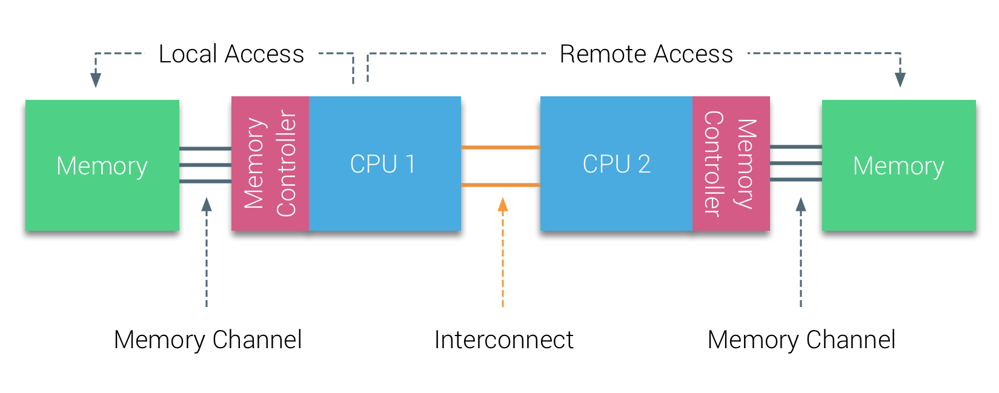

# Multiprocessor Systems

By developing single processors with increasingly sophisticated instruction-level parallelism and higher clock frequencies, computer architects kept performance growth in line with Moore's Law through the early 2000s. Beyond that point, higher clock speeds would have demanded prohibitively high power consumption. This constraint ushered in the modern age of multicore and multithreaded processor designs, which depend on programmers writing parallel code to speed up individual programs. A **multiprocessor system** combines multiple processors working toward one goal: faster overall execution. We categorize these systems along two axes: how processors access memory, and whether the system mixes identical processors or different processor types.

## Introduction

### Shared Memory Multiprocessor Systems

**Shared memory multiprocessor systems** are parallel computing architectures where multiple processors share access to a common physical memory space. Because all processors can read from and write to the same memory locations directly, they communicate through shared variables instead of explicit message passing. Since each processor still keeps its own private cache, these systems need cache coherency mechanisms so all processors see a consistent, correct view of memory. There are two kinds of shared memory multiprocessor systems: **UMA (Uniform Memory Access) Systems** and **NUMA (Non-Uniform Memory Access) Systems**.

#### Uniform Memory-Access (UMA) System

In a UMA system, all processors have equal access time to all memory. UMA systems are typically implemented as **Symmetric Multiprocessing (SMP)**, an architecture where multiple identical processors run under a single operating system with shared access to centralized main memory. Sharing memory, I/O devices, and the interrupt system through an interconnecting system bus, each processor can still execute different programs on different data. Each processor also maintains its own local cache, a fast intermediary between the processor and main memory.

#### Non-Uniform Memory-Access (NUMA) System

SMP systems with bus snooping scale effectively up to around 8-16 processors, but beyond that point they hit fundamental limitations. As processor count grows, constant snooping and invalidation messages saturate the shared bus with excessive traffic. Physical constraints compound the problem: at high clock speeds, wire length and signal propagation delays (approaching the speed of light) become significant bottlenecks. A single shared memory controller also cannot supply enough bandwidth for many processors accessing memory at once.

**NUMA architectures** address these scalability limits by changing the memory organization fundamentally. Instead of a single shared memory accessible uniformly by all processors, NUMA systems distribute memory physically across multiple nodes, each containing one or more processors and its own local memory. Processors can still access any memory location, maintaining a shared address space, but access times become non-uniform: local memory on the same node is fast, while remote memory on another node is much slower, since reaching it means traversing inter-node interconnects. This distributed organization eliminates the single shared bus bottleneck, letting NUMA systems scale to hundreds or thousands of processors.

Rather than relying on bus snooping, NUMA systems maintain cache coherency through directory-based protocols. Each NUMA node contains directory hardware, typically integrated with or located near the memory controller, that tracks the state of memory blocks residing on that node. For each cache line, the directory stores a valid bit per processor (which processors have that line cached) and a dirty bit (whether any processor has modified the data). These distributed directories then communicate over the interconnect network to coordinate cache coherency across all nodes.

When a processor requests data, the request routes to the home directory of the node where that memory resides. The directory checks its metadata: if the data is clean (the dirty bit is not set), it provides the data directly and sets the valid bit for the requesting processor. If the data is dirty, the directory retrieves the updated value from the processor holding it, writes it back to main memory, then hands it to the requester. When a processor writes to a cache line, the directory sends invalidate messages only to the processors with valid bits set, the ones that actually have the line cached. Since SMP systems instead broadcast invalidate messages to every processor on the shared bus and force each one to check whether the message applies, this targeted invalidation is far cheaper. By eliminating broadcast traffic, the directory-based approach lets NUMA systems scale to hundreds or thousands of processors. For very large systems, hierarchical directory schemes go further, using multiple directory levels that communicate over general-purpose interconnect networks instead of shared CPU buses.

For systems programmers, NUMA awareness matters mainly for performance, since remote memory accesses can run 2-3x slower than local ones. Tools like `numactl` bind processes and memory allocations to specific nodes, maximizing fast local accesses while minimizing expensive cross-node traffic.

### Distributed Memory Multiprocessor Systems

In **distributed memory multiprocessor systems**, each node keeps its own private memory, with no shared address space tying them together. Since processors cannot read or write each other's memory directly, all communication requires explicit message passing over a network (e.g., MPI).

Scaling to thousands or millions of nodes (clusters, supercomputers), this architecture suits embarrassingly parallel workloads with high computation-to-communication ratios especially well. The tradeoff is network latency, which sits orders of magnitude below RAM in the memory hierarchy, making this architecture a poor fit for tightly coupled algorithms that need frequent data exchange between nodes.

## Cache Coherence

Since each processor keeps its own private cache, the critical challenge in SMP systems is maintaining **cache coherency**: ensuring all processors see a consistent view of memory. When one processor modifies data, other processors may hold stale copies, creating inconsistency. SMP systems solve this through **bus snooping**, where each processor monitors a shared bus for cache events from other processors and updates its cache accordingly.

Cache coherency is managed through hardware protocols, with **MESI** being the most common (other protocols include **MOESI** and **MESIF**). MESI stands for the four states a cache line can be in: **Modified**, **Exclusive**, **Shared**, or **Invalid**.

The protocol assigns one of four states to every cache line (mostly in L1 cache), answering two questions at all times: _is main memory up to date?_ and _does any other cache hold a copy?_

- **Modified (M)**: This cache has the only copy, and it has been written to. Main memory is stale. This cache is solely responsible for writing the data back before anyone else can use it.
- **Exclusive (E)**: This cache has the only copy, and it matches main memory. Since no other cache holds the line, a write can proceed without any bus communication.
- **Shared (S)**: This cache holds a copy, and other caches may too. All copies match main memory. The line is effectively read-only, since a write requires coordinating with other caches first.
- **Invalid (I)**: The cache line holds no usable data. Any access is a miss.

For any two caches, the permitted combinations of states for the same cache line are:

| | M | E | S | I |
| :---: | :---: | :---: | :---: | :---: |
| **M** | No | No | No | Yes |
| **E** | No | No | No | Yes |
| **S** | No | No | Yes | Yes |
| **I** | Yes | Yes | Yes | Yes |

Since Modified and Exclusive both mean "I am the only cache holding this line," they exclude every other state except Invalid. Shared can coexist only with Shared or Invalid, since it just means multiple caches hold a clean, read-only copy, which is safe.

### MESI State Transitions

In the scenarios below, Core A is the cache whose state is transitioning. Core B is any other core on the bus whose request Core A observes via snooping.

#### Read miss, no other holder (Invalid → Exclusive)

Core A misses on a read and broadcasts a request on the bus. No other cache responds. Core A fetches the block from main memory and marks it Exclusive, as it is the sole holder and main memory is authoritative.

#### Read miss, another cache holds it (Invalid → Shared)

Core A misses and broadcasts a read request. Core B holds the line and transitions as a consequence:
- If B is in Shared, B stays Shared and Core A loads the line as Shared.
- If B is in Exclusive, B transitions to Shared and Core A loads the line as Shared.
- If B is in Modified, B intercepts the request, writes the dirty data back to main memory first, then both B and Core A transition to Shared.

Once two caches hold the same cache line, both are Shared.

#### Write miss (Invalid → Modified)

Core A has the line as Invalid and wants to write. Core A broadcasts a read-with-intent-to-modify request and fetches the block. Any other cache holding the line must give up its copy as a consequence: if Modified, it writes the dirty data back to main memory first, then goes Invalid; if Exclusive or Shared, it goes Invalid immediately. Core A transitions to Modified and writes.

#### Read hit (Exclusive → Exclusive)

Core A holds the line as Exclusive and reads from it. The data is served directly from the local cache. No bus traffic.

#### Write hit (Exclusive → Modified)

Core A holds the line as Exclusive and wants to write. Since no other cache has a copy, Core A simply writes and transitions to Modified with no bus traffic. This is the fast path.

#### Read hit (Shared → Shared)

Core A holds the line as Shared and reads from it. The data is served directly from the local cache. No bus traffic.

#### Write hit (Shared → Modified)

Core A holds the line as Shared and wants to write. Since Core A already has a valid copy, it broadcasts an invalidate request on the bus. Every other cache holding the line transitions to Invalid as a consequence. Core A transitions to Modified and performs the write. Main memory is now stale.

#### Read or write hit (Modified → Modified)

Core A holds the line as Modified and reads or writes to it again. It is already the sole owner with the authoritative copy, so it serves the access locally and stays Modified. No bus traffic.

#### Eviction (Modified → Invalid)

Core A needs to load a new block into a slot occupied by a Modified line. Before evicting, Core A writes the dirty data back to main memory, then transitions to Invalid and frees the slot.

### Performance Problems

However, cache coherency mechanisms introduce two notable performance problems.

**False sharing** occurs when different variables that happen to reside on the same cache line are modified by different processors. Since cache coherency operates at cache line granularity, modifications to logically independent variables trigger unnecessary invalidations across processors.

For example, if Thread A frequently updates `counter_a` and Thread B frequently updates `counter_b`, but both counters are adjacent in memory and share the same cache line, each write causes the cache line to bounce between processors even though the threads aren't actually sharing data. This ping-pong effect can cause severe performance degradation in multithreaded code.

**Write contention** occurs when multiple processors genuinely write to the same or nearby shared data, triggering constant invalidation messages as cache coherency protocols work to maintain consistency. Each write broadcasts invalidations to every other cache holding that line, marking their copies Invalid while the writing processor marks its own Modified. As processors compete to write, the cache line repeatedly bounces between their caches, creating significant overhead from the constant coherency traffic. While false sharing produces artificial contention, write contention reflects a fundamental limitation: cache coherency protocols grow more expensive as more processors write to shared data. Minimizing it takes algorithmic approaches, like keeping per-thread local data merged only periodically, using lock-free data structures that reduce synchronization points, or redesigning algorithms to cut the frequency of shared writes.

## Memory Consistency

Cache coherency protocols (MESI or MOESI) guarantee that all cores will _eventually_ see the correct value for a memory location, but they say nothing about _when_ that value becomes visible. This is the problem of **memory consistency**: the rules for the order in which memory operations performed by one core become visible to others.

> [!NOTE]
> People often conflate coherence and consistency, but they answer different questions. Cache coherence governs reads and writes to the _same_ memory address, aiming to make a parallel memory system behave as if the caches were not there, just like a uniprocessor's cache stays invisible to the programmer. Memory consistency, by contrast, governs reads and writes to _different_ addresses: specifically, when a write to X becomes visible relative to reads and writes to other addresses.

### The Hardware Gaps

Two hardware structures create windows where cores see inconsistent state even with cache coherency protocols in place.

#### Write buffer (store buffer)

When a core writes a value, the write does not go directly to L1 cache. Instead, it first lands in a **write buffer**, a small queue between the core and its L1, so the core can keep executing without stalling on every write. While a write sits in the buffer, MESI has not triggered yet (i.e., no invalidate has been sent), so other cores reading that address load the old value from their own caches, unaware anything changed.

> [!NOTE]
> Write buffering preserves single-threaded behavior through **store-to-load forwarding**: before going to memory, a read first checks the store buffer for a pending write to the same address, and uses that value if found. In `x = 1; println(x)`, for instance, the write `x = 1` sits in the store buffer before reaching main memory, but `println(x)` forwards directly from the buffer and correctly prints `1`.

To see how this breaks down with multiple threads, consider two threads running concurrently, where `x` and `y` both start at `0` in memory:

- Thread 1: (1) `x = 1`, then (2) `print(y)`
- Thread 2: (3) `y = 1`, then (4) `print(x)`

First, (1) and (3) execute, placing `x = 1` and `y = 1` into their respective store buffers before either write reaches main memory. Then (2) executes on Core 1, reading `y`: its store buffer has no entry for `y`, so it reads from memory and gets `0`. Next, (4) executes on Core 2, reading `x`: its store buffer has no entry for `x` either, so it too reads from memory and gets `0`. At some indeterminate point later, the cache hierarchy drains both store buffers and propagates the writes to memory.

Under x86-TSO and relaxed memory models, this program can therefore print `00`, since both threads observe the other's write as if it hadn't happened yet. SC explicitly rules out this outcome, since it requires a completed write to be immediately visible to all cores. Store buffers introduce exactly this kind of surprise: writes "done" from the issuing core's perspective stay invisible to everyone else until the buffer drains.

#### Invalidation queue

When a write finally commits from the write buffer to L1, MESI sends an invalidate message to every other cache holding that line. But the receiving core does not have to acknowledge it immediately: it goes into an **invalidation queue** so the core does not stall waiting. If a read happens before those invalidations process, the core hits its own now-stale cache line and returns the old value, even though an invalidation was already pending.

So there are two windows where a core can observe stale data:
1. While the write is still in the writer's store buffer (before reaching L1, before any invalidate is sent)
2. While the invalidation is sitting in the reader's invalidation queue (sent, but not yet acknowledged)

### Hardware Memory Models

A **memory consistency model** defines what guarantees a CPU architecture makes about when writes become visible to other cores. Different architectures make different tradeoffs between performance and strictness.

There are four possible ordering constraints between memory operations, where X and Y are not necessarily the same address:

- **W→R**: a write to X must commit before a subsequent read from Y
- **W→W**: a write to X must commit before a subsequent write to Y
- **R→R**: a read from X must commit before a subsequent read from Y
- **R→W**: a read from X must commit before a subsequent write to Y

A memory model is defined by which of these it enforces. Relaxing a constraint means the hardware is free to reorder those operations for performance.

#### Sequential Consistency (SC)

Defined by Lamport (1976), sequential consistency is the ideal model that enforces all four orderings. It makes two guarantees: every memory operation across every core appears to execute in one global sequential order, and each core's own operations appear in that order exactly as they appear in the program (program order). The system therefore behaves as if all cores share a single memory with no caches or buffers, like a switch that picks one core at a time, completes its memory operation atomically, then picks another.

In practice, no modern high-performance CPU implements sequential consistency fully, since doing so would require flushing the store buffer and draining the invalidation queue on every operation, eliminating the very optimizations that make out-of-order and pipelined execution fast.

> [!NOTE]
> The switch can pick any core at any time, so instructions from different cores freely interleave in the global order. It cannot, however, violate a single core's program order: P0's stores and loads must appear in the global sequence in the same order they appear in P0's program, and likewise for every other core.

#### x86 Total Store Order (x86-TSO)

Total Store Order enforces W→W, R→R, and R→W, but **relaxes** W→R: a write sitting in the store buffer can be bypassed by a subsequent read to a different address, so the core reads from its cache before the write commits. Once a write does reach L1, invalidations broadcast to all other cores and process promptly, so although a write may be delayed in the store buffer, all cores observe it at the same time once it lands. Every core therefore agrees on a single coherent global order of writes. TSO is strict enough that most concurrent code works correctly on x86 without explicit memory fences.

#### ARM Relaxed Memory Model

ARM's relaxed memory model can relax all four orderings, making it the weakest common model. Cores can observe writes from other cores in a different order than they occurred, and even two cores can disagree on the order in which writes became visible. Correct concurrent code on ARM therefore requires explicit memory fences at every synchronization point.

### Memory Fences

A **memory fence** (a.k.a memory barrier) is an instruction that forces the CPU to flush one or both buffers before continuing:

- **Store fence**: drain the write buffer so all pending writes reach L1 (and invalidates are sent) before any subsequent stores.
- **Load fence**: drain the invalidation queue so all pending invalidations are acknowledged before any subsequent loads.
- **Full fence**: both.

| | Store fence | Load fence | Full fence |
| :---: | :---: | :---: | :---: |
| x86-64 | `sfence` | `lfence` | `mfence` |
| ARM | `dmb st` | `dmb ld` | `dmb` |

However, memory fences are notoriously expensive, costing hundreds of CPU cycles, and are tricky to use correctly.

This is why concurrent programming requires atomics, mutexes, and memory ordering annotations even on hardware with full MESI coherency: MESI guarantees the right value will eventually be visible, but without explicit fences, there is no guarantee about _when_.

