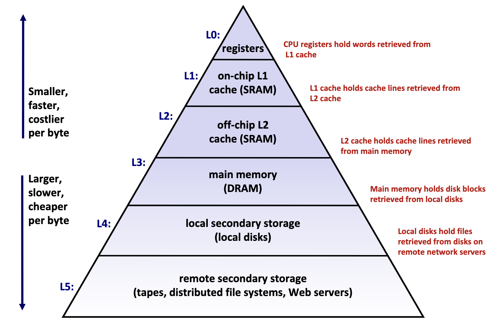
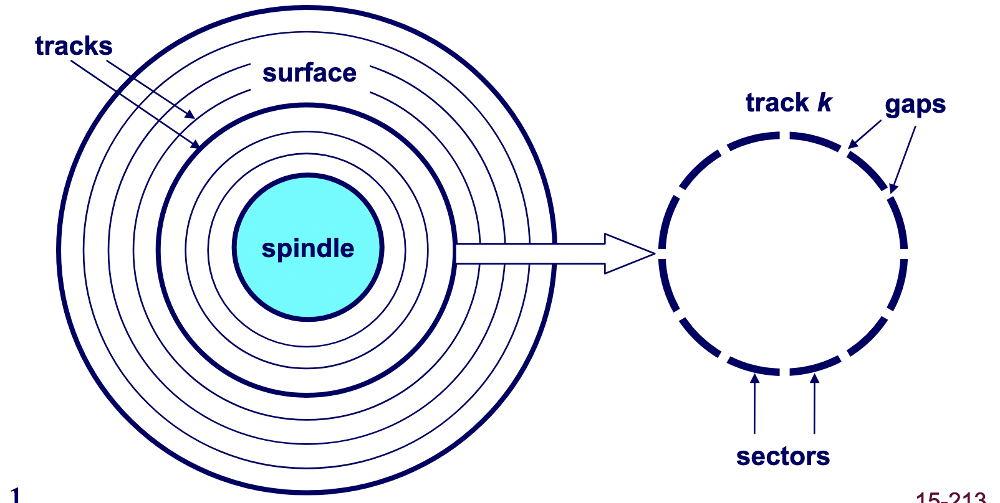
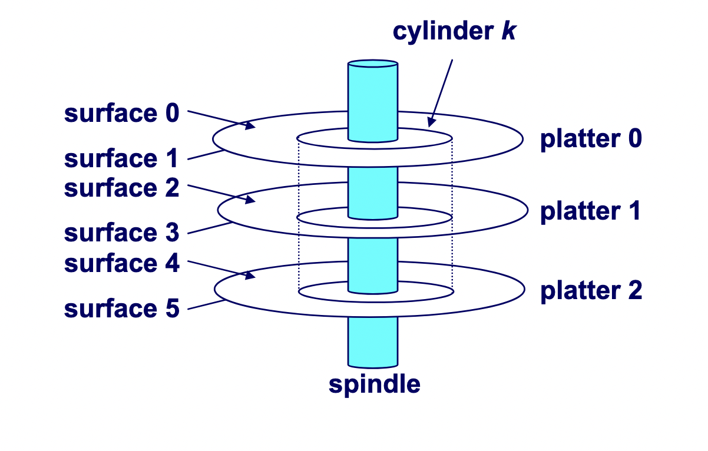
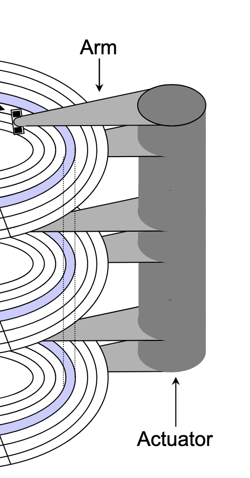
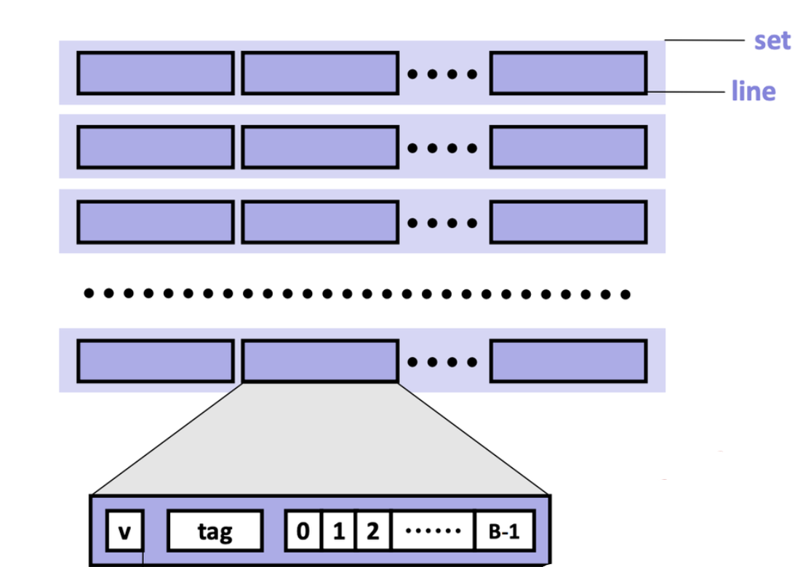
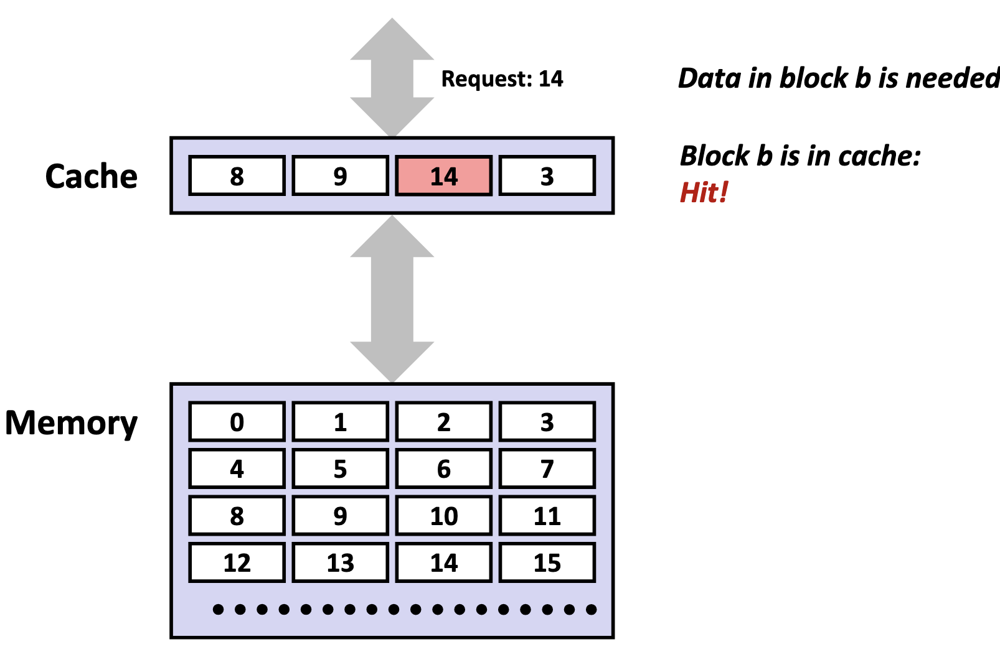
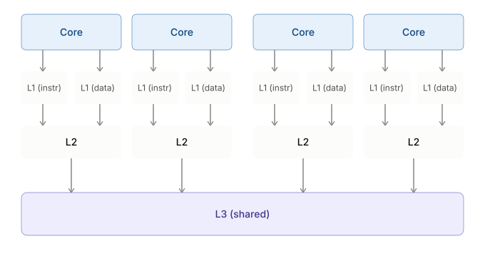

# Physical Memory

## Memory Hierarchy

The memory hierarchy is typically divided into two broad categories:
- **Primary storage**: Devices the CPU can access directly using its instruction set, including registers, caches, and main memory. These devices are **volatile**, meaning they do _not_ retain data when power is lost.
- **Secondary storage**: Devices that the CPU cannot access directly, requiring data to first be copied into primary storage before the CPU can operate on it. These devices are **persistent** or **non-volatile**, meaning they retain data when there are power outages.

Performance is evaluated primarily along three dimensions:
- **Memory Latency**: the time required for a device to deliver requested data after being instructed to do so, measured in time units (nanoseconds, milliseconds) or CPU cycles
- **Memory Throughput**: the amount of data that can be transferred between the device and main memory per unit time, typically measured in bytes per second.
- **Memory Bandwidth**: The upper bound on the amount of data that can be read per unit time, typically measured in bytes per second.

These dimensions are shaped by two key factors:
- The distance from the CPU plays a crucial role, as devices closer to the CPU's processing units can deliver data more quickly.
- The underlying technology of the storage medium heavily influences performance. Registers and caches rely on extremely simple, compact circuits made of only a few logic gates, allowing signals to propagate almost instantly, while mechanical hard drives suffer from delays of 5-15 milliseconds due to the physical need to rotate and align read/write heads.

### Primary Storage

Primary storage devices, notably CPU registers, CPU caches, and main memory, consist of **random access memory (RAM)**, meaning access time stays constant regardless of where the data sits in the device.

Primary storage devices follow two main cell memory designs:
- **Static RAM (SRAM)**: stores data in small electrical circuits and represents the fastest type of memory used to build registers and caches
- **Dynamic RAM (DRAM)**: stores data using capacitors that hold electrical charges and must frequently refresh these charges to maintain stored values, making it ideal for implementing main memory.

### Secondary Storage

The two most common secondary storage devices today are **hard disk drives** (HDDs) and flash-based **solid-state drives** (SSDs).

A hard drive consists of several flat, circular **platters**, each with an upper surface and a lower surface. Organized in concentric rings called **tracks**, each surface breaks into **sectors** separated by **gaps**, and tracks aligned across platters form a **cylinder**. At the centre of each platter sits a **spindle**.

To read or write data, mechanical **arms** attached to a single **actuator** move in unison (extending or retracting) across the platter, each arm carrying a **read/write head** at its tip to position over the cylinder containing the target sector (the sector holding the desired data). This step introduces a performance metric called **seek time**, and the typical average seek time is 3 to 5 ms. The platters then spin counter-clockwise until the target sector sits under the head, introducing a second metric called **rotational latency**, calculated in seconds as $\frac{1}{2} \times \frac{1}{\text{RPM}} \times \frac{60 \text{ seconds}}{1 \text{ min}}$. Finally, the data is read, introducing a last metric called **transfer time**, calculated as $\frac{1}{\text{RPM}} \times \frac{1}{\text{average sectors per track}} \times \frac{60 \text{ seconds}}{1 \text{ min}}$.

## Caching

Caches exist to solve the processor-memory bottleneck problem. According to **Moore's law**, the number of transistors on microchips, and therefore processor performance, doubles every two years, but memory bus bandwidth improves far more slowly. The widening gap starves increasingly powerful processors of data, since they can request information faster than the memory system can deliver it. Caches bridge that gap.

A **cache** is a small, fast memory bank built into the CPU that stores copies of frequently or recently used instructions and data from main memory.

#### Locality of Reference

A program's memory access pattern is called its **locality of reference**, and it comes in two types: **temporal locality** and **spatial locality**.

**Temporal locality** describes the tendency for a recently accessed memory location to be accessed again in the near future. We see this in:
- Loops: the same instructions execute repeatedly, and the same variables are updated each iteration.
- Function calls: a function's code may run many times; its stack frame and local variables are reused throughout its lifetime.
- Hot code paths: frequently executed conditionals and critical sections repeatedly touch the same data structures.

**Spatial locality** describes the tendency for memory locations _near_ a recently accessed address to be accessed in the near future. We see this in:
- Array traversals: sequential accesses like `a[i]` followed by `a[i + 1]`
- Struct field access: fields that are adjacent in memory tend to be read or written together.

By improving locality of reference, a program makes better use of the CPU cache and, as a result, runs faster. Conversely, poor locality leaves the cache under-utilized. Common culprits include:
- Random access over large datasets: jumping around memory whose working set exceeds the cache size leads to frequent cache misses.
- Pointer chasing: traversing linked lists or graphs with scattered heap nodes defeats hardware prefetching and wastes cache lines.
- Cache thrashing: access patterns that repeatedly evict still-useful data, preventing the cache from ever warming up.

### Mechanics

#### Cache Addressing

A cache is made of small chunks of memory copied from main memory, each called a **cache line** and typically **64 bytes**. The cache can only load and store data in multiples of a cache line, its basic unit of transfer.

Each cache line consists of three sections: the **valid bit**, the **tag**, and the **data block**.

- **Valid bit**: Indicates whether the cache line contains valid, up-to-date data corresponding to some address in main memory.
- **Tag**: Stores the high-order bits of the memory address of the data currently cached.
- **Data block**: Contains the actual data copied from main memory.

> [!NOTE]
> For caches using the write-back write hit policy, the cache line also contains a **dirtiness bit**: $1$ when dirty, $0$ when clean.

A cache memory address is split into three fields:
- **Block offset**: Tells _which_ starting byte inside a data block the CPU wants. The number of bits $b$ allocated to the block offset field is $\log_2 (B)$, where $B$ is the data block size.
- **Set index**: Tells _which_ set in the cache to look in. The number of bits $s$ allocated to the set index field is $\log_2 (S)$, where $S$ is the total sets.
- **Tag**: Tells _which_ specific data block the CPU wants to access in the cache. The number of bits $t$ allocated to the tag field is $w - (s + b)$, where $w$ is word size.

#### Accessing the Cache

1. **Locate the set**

    The cache uses the index bits from the memory address to identify which set in the cache might contain the desired block.

2. **Check for a matching tag**

    The cache compares the tag bits from the memory address against the stored tag in each line of that set. A match with the line's valid bit set to 1 is a **cache hit**.

    No match, or a valid bit of 0, is a **cache miss**.

    Cache misses fall into three categories. A **cold (compulsory) miss** happens when data is requested for the first time and isn't yet cached. A **capacity miss** happens when the cache is too small to hold a program's active data, its **working set**, forcing old data out to make room for new. A **conflict miss** happens when a memory address maps to a cache location already occupied by a different line, even though free space exists elsewhere; the existing line is evicted and replaced by the one holding the requested address.

    When a miss occurs, the controller first looks for an invalid line to hold the new data. If every line in the set is valid, one must be replaced: a **replacement policy** picks the line in set-associative and fully associative caches, while a direct-mapped cache automatically selects the single line each block maps to. Once chosen, a dirty line in a write-back cache is written back to the lower memory device first. The controller then fetches the requested block from the next lower memory level, stores it in the selected line, and updates the line's valid bit and tag. Finally, it extracts the requested bytes and delivers them to the processor.

5. **Perform the access (read or write)**

    On a **read**, the CPU retrieves the data directly from the cache line's data block, beginning at the **block offset** from the memory address.

    On a **write hit** (the CPU writes to an address whose block is already cached), it updates the data in the line. What happens next depends on the **write-hit policy**:
    - **Write-through**: The write is immediately propagated to the lower memory to keep all levels synchronized.
    - **Write-back**: The write is deferred, where the cache line is marked **dirty** and only written back to lower memory when evicted or explicitly flushed.

    On a **write miss** (the CPU writes to an address whose block is _not_ cached), behaviour depends on the **write-miss policy**:
    - **Write-allocate (fetch-on-write)**: The missing block is first loaded from main memory into the cache, and then the write is performed. Typically paired with write-back, since once the block is cached, multiple writes can be performed locally without repeatedly accessing main memory.
    - **No-write-allocate (write-around)**: The data is written directly to main memory without loading the block into the cache. Typically paired with write-through, since write-through already ensures main memory stays up to date. If the CPU later _reads_ that address, it's a cache miss, and the block is fetched then.

### Issues

Although caches are designed to accelerate performance by keeping frequently used data close to the CPU, inefficient access patterns can cause the opposite effect.

**Cache pollution** occurs when the cache is filled with data that is unlikely to be reused soon, displacing more valuable data that would have benefited from being cached. This often happens in workloads with poor temporal locality.

**Cache thrashing** is severe performance degradation caused by cache lines being repeatedly evicted and reloaded, forcing the system to spend more time fetching from slow main memory than executing instructions. It happens when a working set exceeds cache capacity, or when access patterns repeatedly conflict.

### Cache Hierarchy

Modern processors organize caches into a three-tier hierarchy:
- **L1 cache**: the smallest and fastest cache, located directly on each CPU core for immediate access.
- **L2 cache**: larger and a bit slower than L1, usually dedicated to a single core but still very close to it.
- **L3 cache**: the largest and slowest of the three, typically shared among all cores on the processor to coordinate data efficiently.

| Level | Common Size(s) |
| :---: | :---: |
| L1    | 32 KB        |
| L2    | 256 KB       |
| L3    | 8 MB or more |

#### Instruction Cache and Data Cache

L1 caches are typically split into **instruction caches (I-cache)** and **data caches (D-cache)**, following the **Harvard Architecture** design principle.

Separating instruction and data caches eliminates contention between instruction fetches and data accesses. A CPU needs to fetch instructions every cycle to keep the pipeline fed, while also loading and storing data for instructions already in execution. With a unified cache, fetches and accesses in the same cycle would compete for the same **cache port**, the read/write path into the cache's memory array. That competition creates a **structural hazard**, where two operations contend for the same hardware resource and one must stall until it frees up. Splitting the L1 cache lets fetches and accesses proceed simultaneously, keeping the pipeline busier and raising **instructions per cycle (IPC)**, and with it, processor performance.

Separate caches also add design flexibility. Instruction streams follow mostly sequential, highly predictable patterns and rarely self-modify, while data accesses are more random and frequently involve writes. This difference lets hardware designers optimize each cache type:
- **I-cache optimization**: Can be designed as read-only with sequential access patterns, enabling aggressive prefetching of subsequent instruction lines while avoiding the complexity and cost of write-back circuits, cache invalidation logic, and coherency protocols.
- **D-cache optimization**: Must handle the full complexity of read/write operations, cache coherency, and the unpredictable access patterns typical of data operations.

### Cache Associativity

A **fully-associative cache** lets any memory block be stored anywhere in the cache. Each access checks _every_ line in parallel, which is still expensive for reasonably sized caches.

To address this, caches restrict where specific memory blocks can reside, at a cost: since the cache is far smaller than main memory, multiple addresses inevitably map to the same cache location, a phenomenon called **cache aliasing**.

A **set-associative cache** is a cache where a memory block maps to a specific **set** (i.e., a compartment of the cache), according to the index field encoded in the memory block's address. Each set contains $N$ cache lines, so we typically specify a cache as **$N$-way set-associative**. The cache hardware uses the index field to select a set, then searches all $N$ lines in that set in parallel.

A **direct-mapped cache** maps each memory block to exactly one specific cache line based on the index field encoded in the memory block's address. No searching is needed, as the hardware directly computes which single cache line to check.

As such, the total cache size (in bytes) is determined as follows:

$$
\text{cache size} = \text{total sets} \times \text{cache lines per set} \times \text{data block size}
$$
