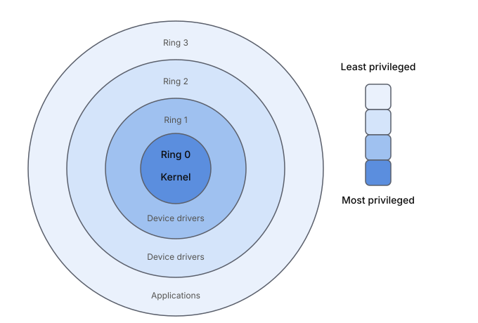

# Kernel Interface

An **operating system (OS)** is the core software that manages a computer's hardware and provides a platform for running other software (applications).

An operating system is analogous to:
- An illusionist: it provides clean, easy-to-use abstractions of physical resources
  - Processor → Thread
  - Memory → Address Space
  - Disks, SSDs, … → Files
  - Networks → Sockets
  - Machines → Processes
- A referee: it manages protection, isolation, and sharing of resources
- Glue: it glues common services together

The operating system's core program that always runs is called the **kernel**.

The kernel communicates to the hardware directly, or through systems programs called **device drivers**.

## Privileges

The hardware is organized in terms of protection rings. It has at least two protection rings:
- Kernel/supervisor/priviledged mode
  - full access to all hardware
  - the kernel is the systems program that runs here
  - ring 3
- User mode
  - restricts access on which instructions can be executed and which memory can be accessed.
  - regular applications programs run here
  - ring 0

This is enforced by a special register or a flag in the CPU, called a **mode bit**, that tracks which mode it's currently in. 
- `mode bit = 1`: kernel mode.
- `mode bit = 0`: user mode.

In order for applications programs to perform privilege operations, it must request the kernel to carry it out on its behalf, and waits for the result. We call this request a **system call**. 

System calls vary in terms of the specific operation being requested (e.g., reading a file, writing to a socket, allocating memory, creating a process, etc.) and the kernel keeps track of and distinguishes between them by assigning each one a unique integer ID called a syscall number.

A system call work as follows:

1. The application program calls a specific system call via a small wrapper function (usually in libc). This wrapper function will:
   - Move the syscall number and the syscall arguments each into registers
   - Execute the `syscall` instruction, triggering a **trap**: a synchronous exception, reproducible at exactly the same point in the code on re-run.
3. The trap instruction will them perform two actions atomically:
    - Switch the CPU's privilege level from ring 3 to ring 0 by flipping the mode bit from 1 to 0
    - Jump to a fixed, kernel-controlled entry point
4. Once inside the kernel with elevated privilege, the kernel looks at a syscall number and arguments, figures out what was requested, and performs the operation itself.
5. When done, the kernel executes a return-from-trap instruction which switches the CPU back to ring 3 and resumes the application program.

