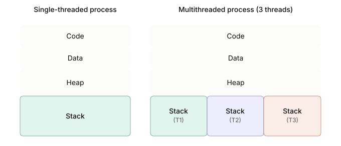

# Threads

A **thread** is



## Threads vs Processes

Threads and processes share similarities:
- Both have their own logical control flow.
- Both can run concurrently
- Both are context switched

And differ in two areas:
- Threads run in a shared memory space (notably share code and data), while processes typically run in separate memory spaces.
- Creating processes is more expensive than creating threads.

## Creating & Joining Threads

We create threads with `std::thread::spawn`, which accepts a closure for the thread to run.

Each thread has a thread ID; the current thread's ID is accessible via `std::thread::current().id()`.

Because `std::thread::spawn` requires the closure to be `'static`, it can't hold references to local variables that might be dropped once the spawning function ends; every variable the closure captures must instead be moved into it, transferring ownership via the `move` keyword.

Rust's threads API enforces this strict behavior because a thread often runs until the very end of the program's execution: left unchecked, it could hold onto, then use, a reference to a variable no longer in scope, a bug known as a **use-after-free**.

Since the closure itself must also be `Send`, every variable it captures must be `Send` as well.

To ensure threads complete before the spawning function returns, call `.join()` on their `JoinHandle`s, the value `std::thread::spawn` returns.

This pattern of splitting work into parallel tasks and joining their results is also known as **fork/join parallelism**.

```rust
use std::thread;

fn main() {
    let t1 = thread::spawn(worker); // equivalent to thread::spawn(|| worker());
    let t2 = thread::spawn(worker);

    println!("Main thread");

    t1.join().unwrap();
    t2.join().unwrap();
}

fn worker() {
    let id = thread::current().id();
    println!("Thread {id:?}");
}
```

```rust
use std::thread;

fn main() {
    let nums = vec![1, 2, 3];

    thread::spawn(move || {
        for n in &nums {
            println!("{n}");
        }
    })
    .join()
    .unwrap();
}
```

Alternatively, we can create **scoped threads**, threads that won't outlive a given scope, which lets their closures capture non-`'static` data. Scoped threads are created using the `std::thread::scope` function.

Consider the following example:

```rust
use std::thread;

fn main() {
    let nums = vec![1, 2, 3];

    thread::scope(|s| {
        s.spawn(|| {
            println!("count: {}", nums.len());
        });
        s.spawn(|| {
            for n in &nums {
                println!("{n}");
            }
        });
    });
}
```

Calling `std::thread::scope` executes a closure immediately, passing it an argument `s` that represents the scope; since the scope's `spawn` method carries no `'static` bound on its argument type, we can use `s` to spawn threads whose closures borrow local variables like `nums` directly. At the end of the scope, any thread that hasn't been joined yet is automatically joined.

## Returning Values from a Thread

To get a value back out of a thread, return it from the closure; that return value then comes back through the `Result` that `join` produces:

```rust
fn main() {
    let numbers = Vec::from_iter(0..=1000);

    let t = thread::spawn(move || {
        let count = numbers.len();
        let sum = numbers.iter().sum::<usize>();
        sum / count
    });

    let average = t.join().unwrap();
    println!("average: {average}");
}
```